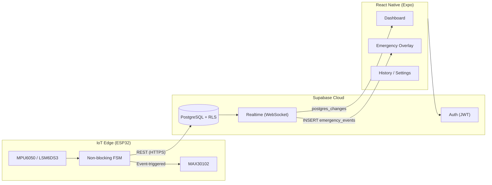
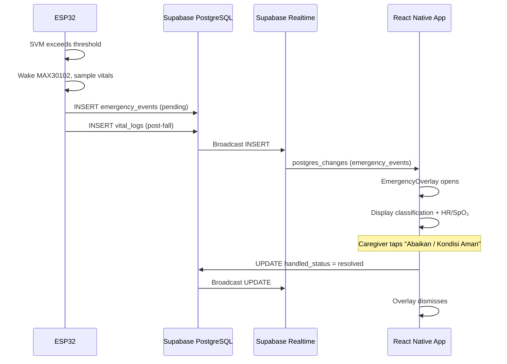

# TerraCare — Final Technical Summary

**Prepared for Thesis Defense (Sidang Skripsi)**  
**Organization:** PT TERRA DIGITAL SYSTEM  
**Project:** TerraCare — Enterprise IoT Health Monitoring & Fall Detection for Elderly Care  
**Status:** Feature Complete (Edge → Cloud → Mobile)

---

## 1. Executive Architecture Overview

### 1.1 High-Level Design

TerraCare implements a **three-tier, event-driven architecture** that separates concerns across the IoT edge, cloud backend, and mobile presentation layers:



| Layer | Responsibility | Key Technologies |
|---|---|---|
| **Edge** | Continuous IMU sampling, fall classification, on-demand oximetry, telemetry ingest | ESP32, C++ FSM, Wi-Fi, ArduinoJson |
| **Cloud** | Persistent storage, authentication, authorization, real-time fan-out | Supabase (PostgreSQL, Auth, Realtime) |
| **Mobile** | Caregiver UX, live vitals, emergency triage, history, configuration | React Native (Expo), TypeScript, NativeWind, Zustand |

### 1.2 Why This Architecture Scales for Professional Medical Use

1. **Decoupled ingestion and presentation** — The ESP32 writes structured events to PostgreSQL via REST; mobile clients subscribe independently. Adding new consumers (admin dashboards, hospital webhooks, analytics pipelines) does not require firmware changes.

2. **Cloud-native data plane** — PostgreSQL provides ACID guarantees for medical audit trails (`vital_logs`, `emergency_events`). Supabase Realtime delivers sub-second notification without custom WebSocket infrastructure.

3. **Edge intelligence reduces noise and power draw** — Fall heuristics and event-triggered oximetry run on-device. The cloud receives *meaningful* events, not raw sensor streams, lowering bandwidth, storage cost, and false-alert volume.

4. **Policy enforcement at the database** — Row-Level Security (RLS) ensures access rules survive application-layer bugs. This is essential when health data is classified as sensitive personal information under Indonesian and international privacy frameworks.

5. **Horizontal device growth** — Each ESP32 is keyed by `mac_address` and linked to a `user_id`. The schema supports thousands of concurrent devices with indexed time-series queries and role-scoped admin oversight.

---

## 2. Logic Flow & Safety

### 2.1 Event-Triggered Triage Algorithm

TerraCare’s core innovation is **Event-Triggered Oximetry** combined with **Multi-Stage Thresholding**. The design prioritizes battery life and clinical relevance: the MAX30102 oximeter remains in low-power sleep until the IMU pipeline confirms a plausible fall.

#### Stage 1 — Impact Detection (Sum Vector Magnitude)

The firmware computes SVM from accelerometer readings:

\[
\text{SVM} = \sqrt{a_x^2 + a_y^2 + a_z^2}
\]

- **Hard fall:** `SVM ≥ current_fall_threshold_g` (default 2.5 g, configurable via Supabase)
- **Soft fall candidate:** `SVM ≥ (current_fall_threshold_g × 0.64)` (~1.6 g at default)

Thresholds are **dynamically pulled** from the `devices` table every 30 seconds during the heartbeat cycle, enabling remote tuning from the mobile Settings screen without reflashing firmware.

#### Stage 2 — Immobility Confirmation (Soft Falls)

For soft-fall candidates, the FSM enters an immobility window:

- If SVM remains below 0.25 g for **3 seconds** within a bounded impact window, a soft fall is confirmed.
- Movement during the window resets the timer, reducing false positives from sitting down quickly or dropping objects.

#### Stage 3 — Event-Triggered Oximetry

Upon fall confirmation, the firmware:

1. Wakes the MAX30102
2. Samples HR and SpO₂ for an **8-second triage window** (500 ms intervals)
3. Retains the best reading for cloud upload

This mirrors clinical triage practice: vitals *after* the incident matter more than continuous background monitoring.

#### Stage 4 — Cloud Ingest & Caregiver Notification

The ESP32 performs two REST inserts (via service role in lab; Edge Function recommended in production):

1. `emergency_events` — fall type (`hard` / `soft`), classification (`confirmed_fall` / `suspected_fall`), `handled_status: pending`
2. `vital_logs` — post-fall BPM and SpO₂ snapshot

### 2.2 End-to-End Safety Flow (Fall → Emergency Overlay)



**Mobile-side behavior:**

- `EmergencyOverlay` subscribes to `emergency_events` INSERT filtered by `user_id`.
- When `handled_status === 'pending'`, a full-screen, high-contrast modal appears with triage data and action buttons (ambulance, emergency contact, dismiss).
- Post-fall vitals are fetched from `vital_logs` and updated in real time via a secondary subscription.
- Dismissal writes `handled_status: resolved` back to Supabase, closing the loop for audit and history.

**Parallel paths for ongoing safety:**

- **Dashboard** — live BPM, SpO₂, battery, and connection status via Realtime on `vital_logs` and `devices`.
- **History** — merged timeline of emergencies and routine checks for post-incident review.
- **Settings** — emergency contacts and dev-mode sensor thresholds synced to the edge.

---

## 3. Security & Access

### 3.1 Row-Level Security (RLS)

RLS is enabled on all clinical tables: `profiles`, `devices`, `vital_logs`, and `emergency_events`.

| Actor | Access Pattern |
|---|---|
| **Authenticated user (caregiver/elder)** | SELECT/UPDATE own profile; CRUD own devices; READ vitals and emergencies linked to owned devices |
| **Admin (`role = 'admin'`)** | SELECT/UPDATE/DELETE on **all rows** via `is_admin()` SECURITY DEFINER helper |
| **ESP32 / Edge Function (service_role)** | INSERT into `vital_logs` and `emergency_events`; PATCH device telemetry (battery, heartbeat) |

RLS policies are defined in versioned SQL migrations (`00001_initial_schema.sql`, `00002_rbac_policies.sql`), ensuring reproducible deployments and auditability.

### 3.2 Role-Based Access Control (RBAC)

The `profiles.role` column drives application routing:

| Role | Mobile Experience |
|---|---|
| `admin` | **AdminDashboardScreen** — global device grid, unresolved emergency counts, cross-user vitals |
| `user`, `caregiver`, `elder` | **DashboardScreen** — personal monitoring, history, settings |

Authentication uses Supabase Auth (JWT). The mobile app fetches the profile on login and stores `userRole` in Zustand for route guards. Session tokens are persisted via Expo SecureStore (native) or localStorage (web).

### 3.3 Privacy & Production Hardening Notes

- **Service role keys must never ship in production mobile builds** — only on secured edge infrastructure or provisioning workflows.
- **Emergency contacts** (`emergency_contact_1`, `emergency_contact_2`) are profile-scoped and editable only by the owning user under RLS.
- **Configurable thresholds** (`fall_threshold_g`, `angle_threshold_deg`) enable per-patient tuning without compromising other users’ data isolation.

---

## 4. Key Technical Wins

### 4.1 TypeScript End-to-End

Strict TypeScript interfaces in `types/supabase.ts` mirror PostgreSQL enums and columns. The mobile client, simulator script, and documentation share a single schema contract, reducing integration defects between firmware payloads and database constraints.

### 4.2 React Native + NativeWind (Gojek-Style UX)

- **Expo Router** for file-based navigation with RBAC-aware entry routing.
- **NativeWind** implements a consistent design system (rounded-2xl cards, emerald primary palette, high-contrast emergency states) aligned with consumer-grade usability expectations.
- **Atomic component structure** (`atoms` / `molecules` / `organisms`) supports maintainability as PT TERRA DIGITAL SYSTEM extends the product line.

### 4.3 Supabase as Managed Backend

- **PostgreSQL** — relational integrity, migrations, indexed time-series queries.
- **Realtime** — eliminates custom WebSocket servers for vitals and emergency push.
- **Auth + RLS** — defense-in-depth for health data without a separate authorization microservice.

### 4.4 ESP32 Non-Blocking Finite State Machine

The firmware avoids `delay()` in the runtime loop:

```
IDLE → IMPACT_DETECTED → IMMOBILITY_CHECK → FALL_DETECTED
     → READING_VITALS → SENDING_DATA → IDLE
```

`millis()` timers govern IMU sampling (50 Hz), oximetry windows, Wi-Fi reconnect, and 30-second heartbeats. Configuration sync runs **only** on the heartbeat path, preventing HTTP blocking from causing missed fall events.

### 4.5 QA & Integration Testing

The `scripts/simulate_esp32.js` Node.js simulator seeds devices, streams vitals, and triggers emergencies — enabling full-stack validation without physical hardware during development and thesis demonstration.

---

## 5. Future-Proofing for PT TERRA DIGITAL SYSTEM

The following three initiatives represent high-impact extensions suitable for commercial deployment and research continuation:

### 5.1 AI-Based Predictive Analytics for Fall Patterns

**Business value:** Shift from reactive alerts to proactive intervention — a differentiator for B2B elder-care facilities and insurance partnerships.

**Technical approach:**

- Aggregate `vital_logs`, `emergency_events`, and IMU-derived features into a Supabase Edge Function or external ML pipeline (e.g., Python + scheduled jobs).
- Train models on temporal patterns: declining SpO₂ trends, nocturnal HR variability, increasing soft-fall frequency.
- Surface **risk scores** on the Admin Dashboard and push gentle caregiver nudges before a hard fall occurs.

### 5.2 Hospital API / EMR Integration

**Business value:** Position TerraCare as a **clinical adjacency platform** — not replacing hospital systems, but feeding structured triage packets into existing workflows (SIMRS, FHIR-compatible EMRs).

**Technical approach:**

- On `emergency_events` INSERT, trigger a Supabase Edge Function that maps TerraCare payloads to HL7 FHIR `Observation` and `DetectedIssue` resources.
- Secure outbound webhooks with mTLS and facility-scoped API keys.
- Include post-fall vitals, timestamp, fall classification, and device geolocation (when available) for emergency department pre-arrival briefing.

### 5.3 BLE Beacon Indoor Positioning

**Business value:** Answer *“Where did the fall occur?”* within home or assisted-living floor plans — critical for multi-story residences and care facilities.

**Technical approach:**

- Deploy fixed BLE beacons (iBeacon / Eddystone) in rooms; ESP32 wearable performs RSSI trilateration or nearest-beacon fingerprinting.
- Attach `room_id` or estimated coordinates to `emergency_events` before cloud insert.
- Render location on the Emergency Overlay and Admin Dashboard floor plan view.

---

## Appendix: Feature Inventory (Feature Complete)

| Module | Location | Capability |
|---|---|---|
| ESP32 Firmware | `firmware/main.ino` | SVM fall detection, event-triggered oximetry, dynamic config sync, Supabase ingest |
| Database Schema | `supabase/migrations/` | Profiles, devices, vitals, emergencies, RLS, RBAC, settings columns |
| Auth & RBAC | `src/store/auth-store.ts`, `src/app/index.tsx` | Login, role routing (admin vs user) |
| Dashboard | `src/screens/DashboardScreen.tsx` | Live vitals, battery, Realtime subscriptions |
| Emergency Overlay | `src/components/organisms/EmergencyOverlay.tsx` | Full-screen triage, dismiss workflow |
| History | `src/screens/HistoryScreen.tsx` | Merged timeline, pull-to-refresh |
| Settings | `src/screens/SettingsScreen.tsx` | Emergency contacts, dev-mode thresholds |
| Admin Panel | `src/screens/AdminDashboardScreen.tsx` | Global monitoring for administrators |
| Hardware Simulator | `scripts/simulate_esp32.js` | End-to-end integration testing |

---

## Closing Statement for Panel Presentation

TerraCare demonstrates that **medically meaningful IoT safety systems** can be built with modern, accessible tooling without sacrificing security or user experience. By combining edge intelligence (Event-Triggered Triage), a policy-enforced cloud data plane (Supabase RLS/RBAC), and a caregiver-first mobile interface (Gojek-style React Native), PT TERRA DIGITAL SYSTEM has a **production-ready foundation** extensible toward predictive analytics, clinical integration, and indoor positioning — aligning technical rigor with real-world elder-care needs.

---

*Document version: 1.0 — Feature Complete Release*  
*Repository: TerraCare Monorepo (mobile-app, firmware, supabase, scripts)*
