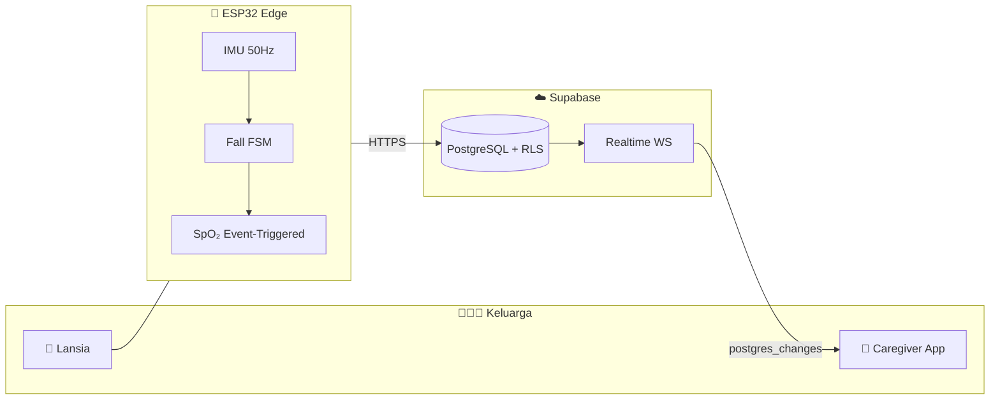

<div align="center">

# 🌿 TerraCare

### *Menjaga orang tersayang — dari jarak dekat maupun jauh*


<br/>

 · Health-Tech · Fall Detection · Real-Time Vitals

<br/>

[🚀 Quick Start](#-quick-start-5-menit) ·
[👨‍👩‍👧 Simulasi Keluarga](#-simulasi-penggunaan--cerita-keluarga-budi) ·
[🏗 Arsitektur](#-arsitektur-sistem) ·
[📱 Mobile App](#-aplikasi-mobile) ·
[🛡 Demo Mode](#-demo-mode-sidang)

</div>

---

## 💚 Mengapa TerraCare?

> *"Kakek Budi tinggal sendiri di Bandung. Anaknya, Rina, bekerja di Jakarta. Setiap malam Rina bertanya: **Apakah Ayah baik-baik saja?**"*

**TerraCare** menjawab pertanyaan itu dengan **presisi IoT** dan **kehangatan perawatan keluarga**:

| 👴 Lansia | 📱 Caregiver | ☁️ Cloud |
|-----------|--------------|----------|
| Wearable ESP32 ringan | Dashboard live BPM & SpO₂ | Supabase Realtime |
| Deteksi jatuh otomatis | SOS → notifikasi keluarga | Data aman (RLS + JWT) |
| Oximeter saat insiden | Riwayat & insights kesehatan | Audit trail darurat |

<div align="center">

```
   👴 Kakek Budi          📡 ESP32 Hub           ☁️ Supabase           👩‍💼 Rina (Caregiver)
       │                      │                      │                        │
       │  ─── jatuh terdeteksi ──►  ─── INSERT ──►  ─── Realtime ──►  🚨 Overlay Merah
       │                      │                      │                        │
       │  ◄── oximeter 8 detik ──  ◄── vital_logs ──  ◄── 78 BPM ────────  ✅ Tenang
```

</div>

---

## 👨‍👩‍👧 Simulasi Penggunaan — Cerita Keluarga Budi

### 🎬 Scene 1 · Pagi Hari — Rina Membuka App

```bash
cd mobile-app && npx expo start -c
# Scan QR · Login · Tab Monitoring
```

| Langkah | Aksi Rina | Layar App |
|---------|-----------|-----------|
| 1️⃣ | Buka TerraCare, login | Splash hijau → kartu auth |
| 2️⃣ | Tab **Monitoring** | `LIVE CONNECTED` · **78 BPM** · **98% SpO₂** |
| 3️⃣ | Tab **Insights** | Grafik tren 24 jam — "Kondisi stabil" |
| 4️⃣ | Tab **Activity** | Riwayat: *Deteksi Normal*, *Kalibrasi Berhasil* |

### 🎬 Scene 2 · Siang — Hubungkan Perangkat Ayah

| Langkah | Aksi | Hasil |
|---------|------|-------|
| 1️⃣ | **Settings → Hubungkan Perangkat** | Modal Serial Number |
| 2️⃣ | Ketik `TC-ALPHA-01` → **Hubungkan** | Haptic success ✅ |
| 3️⃣ | Kembali ke Monitoring | Device **Hub-Alpha-01** online |

> 💡 **Tanpa Bluetooth.** ESP32 sudah ter-provision di cloud — cukup klaim serial number.

### 🎬 Scene 3 · Sore — SOS Darurat

| Langkah | Aksi | Hasil |
|---------|------|-------|
| 1️⃣ | Tap **SOS FAB** merah | Haptic error · sheet konfirmasi |
| 2️⃣ | **Kirim SOS ke Keluarga** | Overlay: *MENGHUBUNGI KELUARGA...* |
| 3️⃣ | Tunggu 3 detik | *KELUARGA TELAH MENERIMA NOTIFIKASI* |
| 4️⃣ | **Batalkan Darurat** | Kembali normal · event tercatat |

### 🎬 Scene 4 · Malam — Logout Aman

Settings → **Keluar** → konfirmasi → kembali ke login **tanpa overlay merah** (state dibersihkan otomatis).

---

## 🚀 Quick Start (5 Menit)

### 1 · Supabase Cloud

Jalankan migrasi berurutan di **SQL Editor**:

```
00001_initial_schema.sql → 00002_rbac_policies.sql → 00003_settings_schema.sql
→ 00004_emergency_manual_insert.sql → 00005_device_claim.sql
```

Seed device demo:

```sql
INSERT INTO public.devices (user_id, mac_address, name, status)
SELECT id, 'TC-ALPHA-01', 'Hub-Alpha-01', 'online'
FROM public.profiles WHERE role = 'admin' LIMIT 1
ON CONFLICT (mac_address) DO NOTHING;
```

### 2 · Mobile App

```bash
git clone https://github.com/valdomuhammaddd/Terracare.git
cd Terracare/mobile-app
npm install
cp .env.example .env
```

```env
EXPO_PUBLIC_SUPABASE_URL=https://YOUR_PROJECT.supabase.co
EXPO_PUBLIC_SUPABASE_ANON_KEY=your-anon-key
EXPO_PUBLIC_DEMO_MODE=true
```

```bash
npx expo start -c
```

| Platform | Perintah |
|----------|----------|
| 📱 HP fisik | Scan QR · **Expo Go SDK 56** |
| 🍎 iOS | Tekan `i` |
| 🤖 Android | Tekan `a` |

### 3 · Buat Akun Caregiver

App → **Daftar sekarang** → isi nama, email, password → **Monitoring** 🎉

---

## 🏗 Arsitektur Sistem



**Alur data:** Impact → Immobility 3s → Oximetry 8s → Cloud INSERT → Realtime push → Emergency/Family overlay.

---

## 📱 Aplikasi Mobile

<div align="center">

| Tab | Fungsi | Highlight |
|-----|--------|-----------|
| 💓 **Monitoring** | Live BPM · SpO₂ · Baterai | Panggil Bantuan · Notifikasi |
| 📊 **Insights** | Tren 24 jam · Rata-rata vital | Chart kesehatan |
| 🚶 **Activity** | Riwayat insiden & vital | Tap → detail sheet |
| 🏥 **Care** | Grid 8 pintasan | Emergency · Family · Track |
| ⚙️ **Settings** | Profil · Kontak darurat · Hubungkan alat | Logout aman |

**SOS FAB** 🆘 tersedia di semua tab · **Demo Mode** otomatis saat offline

</div>

### Tech Stack


---

## 🛡 Demo Mode (Sidang)

Saat `EXPO_PUBLIC_DEMO_MODE=true` (default):

| Data | Nilai Mock |
|------|------------|
| 💓 Detak jantung | **78 BPM** |
| 🫁 SpO₂ | **98%** |
| 🔋 Baterai | **87%** |
| 📡 Device | **Hub-Alpha-01** |
| 🟢 Status | **Online** |

- Error Supabase **tidak menampilkan Alert** — UI tetap jalan
- SOS manual **tidak bentrok** dengan overlay jatuh (`manual_trigger` di-filter)
- Logout **membersihkan** state overlay darurat

---

## 📂 Struktur Repository

```
Terracare/
├── mobile-app/          # 📱 React Native · Expo Router · Zustand
├── supabase/migrations/ # 🗄️ 00001 – 00005 (schema + SOS + device claim)
├── firmware/main.ino    # 📡 ESP32 fall detection + cloud ingest
└── scripts/             # 🧪 simulate_esp32.js (tanpa hardware)
```

---

## 🔐 Keamanan

| Kontrol | Status |
|---------|--------|
| Row-Level Security | ✅ Semua tabel klinis |
| JWT + SecureStore | ✅ Session mobile |
| RBAC admin/caregiver | ✅ `is_admin()` |
| Audit emergency | ✅ `handled_status` workflow |

---

## 🆘 Troubleshooting

| Masalah | Solusi |
|---------|--------|
| UI tanpa styling | `npx expo start -c` |
| Data `--` / offline | `EXPO_PUBLIC_DEMO_MODE=true` |
| Tombol tidak klik | Restart cache · pastikan overlay idle |
| SOS Alert muncul | Demo mode = silent · apply migration 00004 |
| Expo Go error | Install **SDK 56** dari expo.dev/go |

---

## 🗺 Roadmap

| Versi | Fitur |
|-------|-------|
| **v1.0** ✅ | Fall detection · Family SOS · Device claim · Demo mode |
| v1.1 | ML risk score |
| v1.2 | FHIR / SIMRS |
| v1.3 | Indoor positioning |

---

<div align="center">

### 🌿 *Empathetic Precision for Elder Care*

**Dikembangkan dengan ❤️ oleh PT TERRA DIGITAL SYSTEM**

<br/>

[](https://github.com/valdomuhammaddd/Terracare)

*Untuk Ayah, Ibu, Kakek, Nenek — dan keluarga yang menjaga mereka.*

</div>
